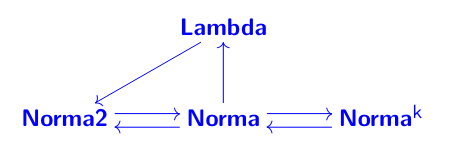

# Cálculo Lambda (λ)

## Sintaxe

λx.x y = `\x.(x y)`
- (x y): escopo de λx
- x y: aplicação @(x,y)

## Numerais de Church
    0 = \f x.x
        \f - operação
        \x - base
        x - 0 vezes f sobre x

    1 = \f x.f x
        \f - operação
        \x - base
        f x - 1 vez f sobre x
    
    2 = \f x.f(f (f x))
        \f - operação
        \x - base
        f (f x) - 2 vezes f sobre x

    n = \f x. f(f(f ... (f x))), (f x) n vezes

## Sucessor
    succ = \n. \A B. A (n A B)

        (n A B) - @(A,B), n vezes
        A (n A B) - @(A,B), n+1 vezes

## Adição
    add = \n1 n2. n1 succ n2
        n1 vezes o succ de n2

    add2 = \n1 n2. \A B. n1 A (n2 A B)

## Multiplicação
    = (\x. add n2 x)
        Dado um número x, soma n2 a x

    mult = \n1 n2. n1 (\x. add n2 x) 0
        Dado um número x, soma n2 a x, n1 vezes a sobre o valor inicial 0

## Teste Zero
    \n. n (operação) (caso base)
        - Se n rodar 0 vezes sobre a operação, retorna caso base
        - Se n rodar no mínimo uma vez, retorna operação
  
    isZero = \n. n (\x.false) (true)

## Pares
    pair M N = \ m n c. c m n
        -- par M N, onde c é controle

    fst = \p. p true
    snd = \p. p false

## Predecessor
```haskell
    swap = \p. pair (snd p) (fst p)
        -- Constrói um novo par invertendo a ordem dos elementos do par original

    shiftInc = \p. pair (snd p) (succ (snd p))
        -- Constrói um novo par com 
            -- o primeiro elemento composto pelo segundo elemento (snd) do par original (p)
            -- o segundo elemento composto pelo sucessor (succ) do segundo elemento (snd) do par original (p)

    pred = \n. fst(n shiftInc (pair 0 0))
        -- Constrói o par (n-1, n) e extrai o n-1
``` 

## Subtração
```haskell
  sub = /a b. b pred a
    -- Calcula a-b, fazendo b vezes o predecessor de a
    -- Ex.: sub 5 2, roda 2 vezes o predecessor sobre 5
```
## Menor que
    isPos = \n. not (isZero n)
      -- Se um número não é zero
    
    less = \a b. isPos(isZero (sub b a))
      -- Se a é estritamente menor que b, valor da diferença entre b e a é positivo
      -- Se valor é positivo, logo a é estritamente menor que b

# Listas
    empty = \x. true
    cons = \h t. pair h t = pair
      -- h: head
      -- t: tail
    head = fst
    tail = snd

    isEmpty = \L.L (\x \y. false)
      -- Aplica o L em um falso-seletor
        -- Recebe duas coisas, mas retorna sempre uma cte
      -- Se recebe empty (\x.true), devolve true
      -- Se recebe cons (\c. c h t)
        -- \x y. é colocado no lugar do c e consome h t
          -- Falso seletor ignora e retorna falso

    -- Segundo elemento da lista [a,b,empty]
    head (tail (cons a (cons b empty)))

## Recursão
  Ponto fixo: um ponto que é mantido fixo ao passar por uma transformação

  S: Padrão de recursão

  S(I) = I
  - I deve ser ponto fixo do padrão S
     -  Quando aplica o padrão, a função fica inalterada
      - Para ser ponto fixo de um padrão S, S(I) deve ser uma sequência infinita de repetições do padrão, pois colocar um nível a mais não afeta a função

  Combinador Y (combinador de ponto fixo):
  ```haskell
    Y = \f. (\x. f (x x)) (\x. f (x x))

    -- Ex.: Y A
      -- Gera recursivamente um nível a mais de A
      -- (A (A (A (A ...))))
      -- É FP? Sim, S(YS) é beta eq. YS

    -- Ex.: fatorial
    fat_circular = \n. if (isZero n)
                          l
                          (mult n (fat (pred n)));

    S_Fat = \R. \n. if (isZero n)
                    l
                    (mult n (R (pred n)));

    fat = Y S_fat;
  ```

  Exemplos:
  ```haskell
  -- Tamanho de uma lista (len: list nat -> nat)
  len_circ = \l. if (isEmpty l)
                    zero
                    (succ ( len ( tail l)));

  S_len = \R. \l. if (isEmpty l)
                      zero
                      (succ ( R ( tail l)));

  len = Y S_len

  -- Ex.: aplicação
  len (cons 1 (cons 2 (cons 3 (cons 4 empty))));

  -- Ex.: somatório dos elementos de uma lista
  S_sum = \R. \l. if (isEmpty l)
                      zero
                      (add (head l) (R (tail l)));
  sum = Y S_sum
  ```

<!-- ## Funções de alta ordem

map: Consome uma operação e uma lista e roda a operação em todos os elementos da lista 
```haskell
-- Ex.: map succ (cons 3 (cons 1 empty)) => (cons 4 (cons2 empty))
```
filter: passado um teste e uma lista, apenas mantém na lista os resultados verdadeiros do teste
```haskell
-- Ex.: filter par (cons 3 (cons 2 (cons 1 empty)))
```

fold: passado uma operação binária com um ponto de partida e uma lista, troca o último valor pelo ponto de partida e aplica a operação no resto
```haskell
-- Ex.: fold + 0 (cons 3 (cons 2 (cons 1 empty)))
``` -->

## Termo Universal
```haskell
U = \f.\x.f x
```

## Lambda simula NORMA
Teorema: o cálculo lambda é tão poderoso computacionalmente quanto programas monolíticos em máquina norma. Logo, Lambda simula norma

## NORMA simula Lambda
Teorema: NORMA (com programas monolíticos) é computacionalmente tão poderosa quanto cálculo Lambda.



Grafo - equivalência entre modelos de computação

## Revisão pra Prova 1

### Parte 1 - Conceitos e NORMA
- Conjunto contável / incontável
  - Provar
    - Codificação de triplas ou somar componentes e comparar, se for igual comparar componente a componente
- Algoritmos, programas, máquinas, computação, função computada, equivalência de programas e equivalência de máquinas
  - Algoritmo: conceito
  - Programa: conceito, descrição de algoritmos em uma linguagem, definição formal (monolíticos, iterativos*)
    - Monolíticos: fluxogramas, instruções rotuladas  
  - Máquinas: entrada, saída, estados, função entrada/saída, interpretações das operações, interpretações dos testes
  - Computação: sequência de snapshots, programa + entrada
    - norma: (rótulo, memória)
    - para ou não para
  - Função computada: relação entre entradas e saídas
    - Funções parciais (pode entrar em loop) [Norma é naturais para naturais]
  - Equivalência de programas:
    - Em uma máquina, quando tem a mesma f computada
  - Equivalência forte:
    - Programas equivalentes entre máquinas diferentes
  - Equivalência de Máquinas:
    - Simulação
      - M simula N e N simula N: Nenhum do conjunto de funções computadas de um é maior que outro (não faz mais coisas que outra)
      - Quando tem E/S diferentes, precisa de codificação e decodificação possível e demonstrável
- NORMA
  - Definição, aritmética
  - Estrutura de dados (codificação)
  - Endereçamento direto e indireto
    - NORMA2 simula NORMA
    - Programa Universal
  - Exercícios de programação

### Parte 2 - Lambda
- Expressões regulares
  - Não consegue fazer tal coisa
- Cálculo Lambda
  - Entender código, análise de função computada, saber simular, fazer programa a partir de descrição da máquina
  - Variável, abstração e aplicação
  - Alfa-equivalência
  - Booleanos, if/else
  - Sucessor, predecessor
  - Listas
  - Recursividade, operador de ponto fixo
  - NORMA simula lambda


## Cheatsheet do Rodrigod
```haskell
-- Combinadores basicos
 i  = \x. x ; 
 k  = \x y. x;        
 s  = \x y z. x z (y z);

-- Combinador de ponto fixo      
 fix      = \f. (\x. f (x x)) (\x. f (x x)) ;

-- Logica booleana
 true     =  \a b. a ;
 false    =  \a b. b ;
 if       =  \c a b. c a b ;
 and      =  \a b. a b a ;
 or       =  \a b. a a b ;
 not      =  \p. p false true ;
 xor      =  \a b. (or (and (not a) b) (and a (not b))) ;
 sss      =  \a b. (not (xor a b)) ;

-- Pares
 pair     = \a b c. c a b ;
 fst      = \p. p true ;
 snd      = \p. p false ;

-- Numeros naturais
 zero     = \f x. x ;
 succ     = \n p. \q. p (n p q) ;
 pred     = \n. fst (n (\p.(pair (snd p) (succ (snd p)))) (pair zero zero)) ;
 add      = \m n p q. (m p) (n p q) ;
 sub      = \m n. (n pred) m ;
 isZero   = \n. n (\x. false) true ;
 equal    = \m n. and (isZero (sub m n)) (isZero (sub n m)) ;
 lessEq   = \m n. isZero (sub m n) ;
 great    = \m n. not ( isZero (sub m n)) ;
 greatEq  = \m n. isZero (sub n m) ;
 less     = \m n. not (isZero (sub n m)) ;
 mult     = \m n p q. m (n p) q ;
 div      = fix (\M. \m n. if (less m n) zero (succ (M (sub m n) n))) ;
 mod      = fix (\M. \m n. if (less m n) m (M (sub m n) n)) ; 
 exp      = \m n. n m ;
 fatorial = fix (\M. \n. if (isZero (pred n)) 1 (mult n (M (pred n)))) ;

-- Listas
 empty    = \x. true ;
 cons     = \h t. pair h t ;
 isEmpty  = \l. l (\x y.false) ;
 head     = fst ;
 tail     = snd ;
 length   = fix (\M. \l. if (isEmpty l) 0 (succ (M (tail l)))) ;

>> isEmpty (cons 2 empty)
```


